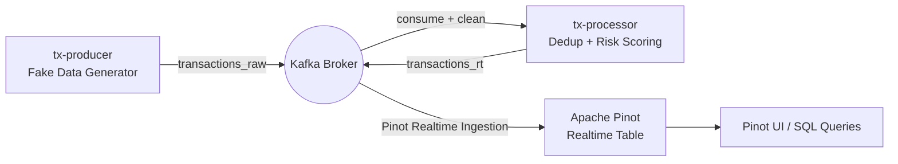

# Real-time Data Pipeline with Apache Pinot & Kafka

This guide explains how to run a full end-to-end **real-time pipeline** with Kafka and Apache Pinot, including **data generation, processing, ingestion, and querying**.

---

## 1. Start Pinot Cluster (Realtime Quickstart)

```bash
docker run -it \
  -p 9000:9000 -p 8099:8099 \
  apachepinot/pinot:latest QuickStart -type realtime
```

- Controller: **9000**  
- Broker: **8099**  
- Zookeeper + Server được start kèm.  

👉 Pinot UI: [http://localhost:9000](http://localhost:9000)

---

## 2. Deploy Schema

Schema file: `conf/transactions_schema.json`

```powershell
$controller = "http://<pinot-host>:9000"

Invoke-RestMethod `
  -Method POST `
  -Uri "$controller/schemas?override=true" `
  -InFile "C:\Users\Dinh Khanh\Downloads\BTL_VSC\conf\transactions_schema.json" `
  -ContentType "application/json"
```

---

## 3. Deploy Realtime Table

Table config: `conf/transactions_realtime_table.json`  
(Source Kafka topic = `transactions_rt`)

```powershell
Invoke-RestMethod `
  -Method POST `
  -Uri "$controller/tables" `
  -InFile "C:\Users\Dinh Khanh\Downloads\BTL_VSC\conf\transactions_realtime_table.json" `
  -ContentType "application/json"
```

---

## 4. Run Data Generator (Producer)

👉 Container sinh dữ liệu giả (Faker) và push vào Kafka topic `transactions_raw`.

```powershell
# Stop old container if exists
docker rm -f tx-producer 2>$null

# Start producer
docker run -d --name tx-producer `
  --restart unless-stopped `
  -v "C:\Users\Dinh Khanh\Downloads\BTL_VSC\crawl_data:/app" `
  -e BOOTSTRAP_SERVERS=93.115.172.151:9092 `
  -e TOPIC_RAW=transactions_raw `
  -e INTERVAL_SEC=2 `
  -e PYTHONUNBUFFERED=1 `
  python:3.11-slim sh -lc `
  "pip install --no-cache-dir kafka-python Faker >/dev/null && python -u /app/rt_producer.py"
```

- Script `rt_producer.py` đã có `while True`, **không cần vòng lặp ngoài shell**.  
- Kiểm tra log:

```powershell
docker logs -f --tail=100 tx-producer
```

Kỳ vọng output:

```
RAW sent seq=... p=0 off=...
```

---

## 5. Run Processor

👉 Container đọc từ `transactions_raw`, dedup + risk scoring, rồi đẩy ra `transactions_rt`.

```powershell
# Stop old container if exists
docker rm -f tx-processor 2>$null

# Start processor
docker run -d --name tx-processor `
  --restart unless-stopped `
  -v "C:\Users\Dinh Khanh\Downloads\BTL_VSC\crawl_data:/app" `
  -e BOOTSTRAP_SERVERS=93.115.172.151:9092 `
  -e TOPIC_RAW=transactions_raw `
  -e TOPIC_CLEAN=transactions_rt `
  -e GROUP_ID=rt-processor-v1 `
  -e DEDUP_MAX_KEYS=50000 `
  -e PYTHONUNBUFFERED=1 `
  python:3.11-slim sh -lc `
  "pip install --no-cache-dir kafka-python >/dev/null && python -u /app/rt_processor.py"
```

Kiểm tra trạng thái container + log:

```powershell
docker ps --format "table {{.Names}}\t{{.Status}}"
docker logs -f --tail=100 tx-producer
docker logs -f --tail=100 tx-processor
```

Ở `tx-processor` bạn phải thấy các dòng kiểu:

```
CLEAN <- RAW off=... → p=0, off=... | label=1 risk=0.20
```

---

## 6. Query Data in Pinot

👉 Query trực tiếp qua REST API hoặc Pinot UI.

```powershell
$body = @{ sql = @"
SELECT create_dt, user_seq, payment_method, transaction_amount_24hour, label
FROM transactions
ORDER BY create_dt DESC
LIMIT 10
"@ } | ConvertTo-Json

Invoke-RestMethod -Method POST -Uri "$controller/sql" -Body $body -ContentType "application/json"
```

---

## 7. Architecture Diagram



---

## Notes

- `transactions_raw` → raw Kafka topic (input from producer).  
- `transactions_rt` → clean Kafka topic (output từ processor).  
- Pinot **realtime table** consume từ `transactions_rt`.  
- Controller UI: <http://<pinot-host>:9000>  
- Broker queries chạy trên port **8099**.  

---

✅ Bạn đã có **working real-time ingestion pipeline** với Kafka + Pinot + custom Producer/Processor!
