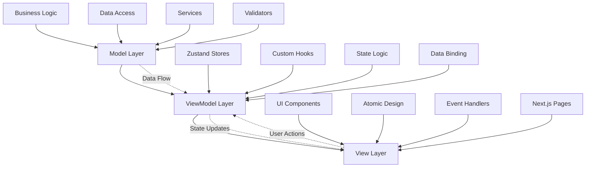
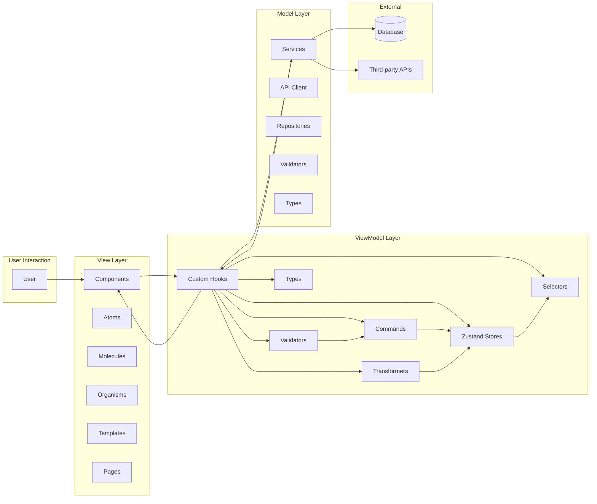
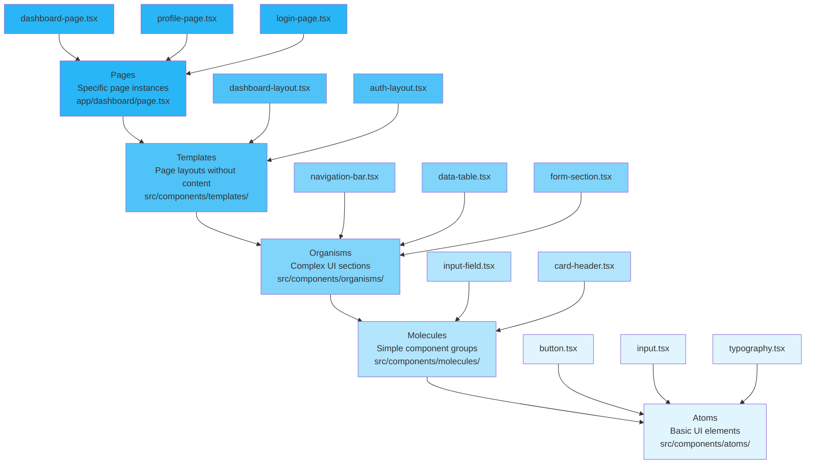
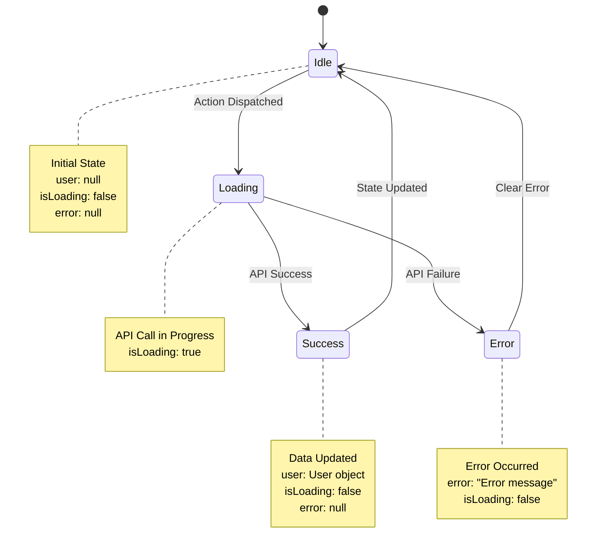
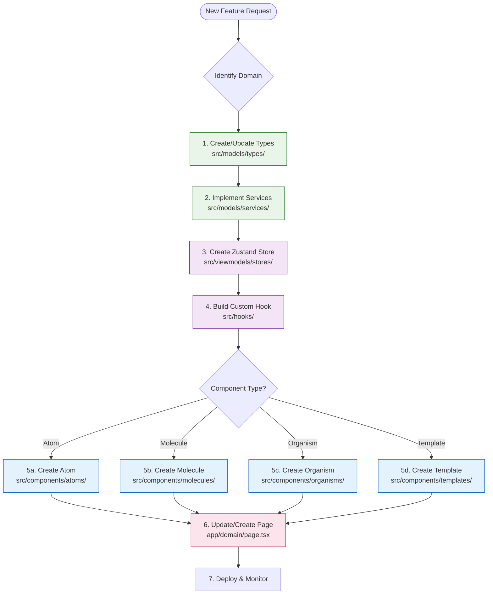
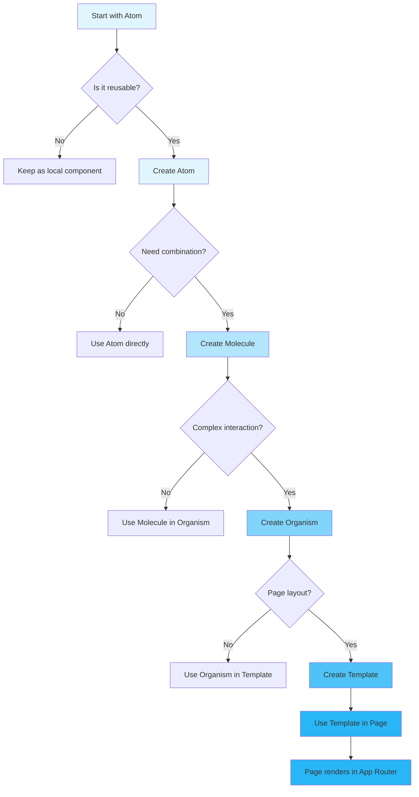

# Realtime Pinot - MVVM Architecture with Atomic Design

## Overview

This project implements a **Fraud Detection Dashboard** using **MVVM (Model-View-ViewModel)** architecture with **Atomic Design** principles. It integrates with **Apache Pinot** for real-time analytics to analyze credit card transactions and detect fraudulent activity.

## Key Features

### 🔍 Fraud Detection System
- **Real-time Transaction Analysis**: Input credit card transaction details for instant fraud scoring
- **Apache Pinot Integration**: Connects to Pinot instance at `http://93.115.172.151:8099/` for advanced analytics
- **Risk Assessment**: Multi-factor fraud scoring with confidence levels based on real transaction patterns
- **Interactive Dashboard**: Monitor fraud metrics, risk factors, and transaction trends
- **Advanced Visualizations**: Charts and graphs for fraud analytics using Recharts
- **Real-time Features**: WebSocket connections for live transaction feeds and fraud alerts
- **Authentication**: Secure login/register system for internal fraud analysis team

### 🎨 Modern Tech Stack
- **Framework**: Next.js 16 with App Router
- **Language**: TypeScript
- **Styling**: TailwindCSS + ShadcnUI + RadixUI + Custom Theme System
- **State Management**: Zustand
- **Data Visualization**: Recharts for interactive charts and graphs
- **Real-time Communication**: WebSocket client for live updates
- **Design System**: Atomic Design (Atoms, Molecules, Organisms, Templates, Pages)
- **Theme**: Blue & White color scheme with dark mode support

### 📊 Advanced Visualizations
- **Fraud Trends Chart**: Real-time transaction volume and fraud patterns over time
- **Risk Factors Chart**: Pie chart showing distribution of fraud detection triggers
- **Fraud Metrics Overview**: KPI cards with trend indicators and area charts
- **Interactive Dashboards**: Hover tooltips, responsive design, real-time data updates

### 🔄 Real-time Features
- **WebSocket Integration**: Live connection for instant updates
- **Transaction Feed**: Real-time stream of processed transactions with risk levels
- **Fraud Alerts Panel**: Push notifications for high-risk transactions
- **Live Analytics**: Continuously updating fraud metrics and statistics
- **Connection Management**: Auto-reconnection and offline handling

## Quick Start

### Prerequisites
- Node.js 18+
- npm or yarn

### Installation
```bash
# Clone the repository
git clone <repository-url>
cd realtime-pinot

# Install dependencies
npm install

# Set up environment variables
cp .env.example .env.local
# Edit .env.local with your configuration

# Start development server
npm run dev
```

### Environment Setup
See the [Environment Configuration](#environment-configuration) section below for detailed setup instructions.

## Architecture Principles

### MVVM Pattern



### Data Flow Architecture



#### Model Layer
- **Location**: `src/models/`
- **Purpose**: Business logic, data access, API services
- **Responsibilities**:
  - Data validation and transformation
  - API communication
  - Business rules and calculations
  - Repository pattern for data access

#### ViewModel Layer
- **Location**: `src/viewmodels/` + `src/hooks/`
- **Purpose**: Bridge between Model and View, manage state and logic
- **Responsibilities**:
  - UI state management with Zustand stores
  - Business logic orchestration through commands
  - Data transformation via transformers
  - Form validation with business rules
  - Computed state through selectors
  - Data binding for components
  - Event handling and user interactions

**Subdirectories:**
- **`stores/`**: Zustand stores for global state management
- **`commands/`**: Complex multi-step operation orchestration
- **`selectors/`**: Computed/derived state from stores
- **`validators/`**: Business logic validation rules
- **`transformers/`**: Data transformation between models and view models
- **`types/`**: ViewModel-specific type definitions

#### View Layer
- **Location**: `src/components/` + `app/` (pages)
- **Purpose**: User interface components
- **Responsibilities**:
  - Render UI based on ViewModel state
  - Handle user interactions
  - Follow Atomic Design structure

### Atomic Design System



#### Atoms
- **Location**: `src/components/atoms/`
- **Purpose**: Basic building blocks
- **Examples**: Button, Input, Icon, Typography

#### Molecules
- **Location**: `src/components/molecules/`
- **Purpose**: Groups of atoms forming simple UI patterns
- **Examples**: input-field.tsx (Input + Label + Error), card-header.tsx

#### Organisms
- **Location**: `src/components/organisms/`
- **Purpose**: Complex UI sections composed of molecules and atoms
- **Examples**: navigation-bar.tsx, data-table.tsx, form-section.tsx

#### Templates
- **Location**: `src/components/templates/`
- **Purpose**: Page-level layouts without content
- **Examples**: dashboard-layout.tsx, auth-layout.tsx, content-layout.tsx

#### Pages
- **Location**: `app/` (Next.js App Router)
- **Purpose**: Specific instances of templates with real content
- **Examples**: dashboard-page.tsx, profile-page.tsx

## Project Structure

```mermaid
graph TD
    subgraph "Next.js App Router"
        APP[app/]
        APP1[layout.tsx<br/>Root layout]
        APP2[page.tsx<br/>Home page]
        APP3["(auth)/<br/>Route groups"]
        APP4[dashboard/<br/>Protected routes]
        APP5[api/<br/>API routes]
    end

    subgraph "Source Code (src/)"
        SRC[src/]
    end

    subgraph "View Layer"
        COMP[components/]
        COMP1[atoms/<br/>Basic UI elements]
        COMP2[molecules/<br/>Component groups]
        COMP3[organisms/<br/>Complex UI sections]
        COMP4[templates/<br/>Page layouts]
    end

    subgraph "ViewModel Layer"
        VM[viewmodels/]
        VM1[stores/<br/>Zustand stores]
        VM2[commands/<br/>Operation orchestration]
        VM3[selectors/<br/>Computed state]
        VM4[validators/<br/>Business validation]
        VM5[transformers/<br/>Data transformation]
        VM6[types/<br/>ViewModel types]
        HOOKS[hooks/<br/>Custom React hooks]
    end

    subgraph "Model Layer"
        MODEL[models/]
        MODEL1[types/<br/>TypeScript definitions]
        MODEL2[services/<br/>API services]
        MODEL3[repositories/<br/>Data access]
        MODEL4[validators/<br/>Data validation]
    end

    subgraph "Infrastructure"
        LAYOUTS[layouts/<br/>Layout components]
        CONTEXTS[contexts/<br/>React Context providers]
        UTILS[utils/<br/>Utility functions]
        LIB[lib/<br/>Third-party integrations]
    end

    APP --> APP1
    APP --> APP2
    APP --> APP3
    APP --> APP4
    APP --> APP5

    SRC --> COMP
    SRC --> VM
    SRC --> MODEL
    SRC --> LAYOUTS
    SRC --> CONTEXTS
    SRC --> UTILS
    SRC --> LIB

    COMP --> COMP1
    COMP --> COMP2
    COMP --> COMP3
    COMP --> COMP4

    VM --> VM1
    VM --> VM2
    VM --> VM3
    VM --> VM4
    VM --> VM5
    VM --> VM6
    SRC --> HOOKS

    MODEL --> MODEL1
    MODEL --> MODEL2
    MODEL --> MODEL3
    MODEL --> MODEL4

    classDef app fill:#e8f5e8,stroke:#2e7d32
    classDef view fill:#fff3e0,stroke:#ef6c00
    classDef viewmodel fill:#fce4ec,stroke:#c2185b
    classDef model fill:#e3f2fd,stroke:#1565c0
    classDef infra fill:#f3e5f5,stroke:#6a1b9a

    class APP,APP1,APP2,APP3,APP4,APP5 app
    class COMP,COMP1,COMP2,COMP3,COMP4 view
    class VM,VM1,VM2,VM3,VM4,VM5,VM6,HOOKS viewmodel
    class MODEL,MODEL1,MODEL2,MODEL3,MODEL4 model
    class LAYOUTS,CONTEXTS,UTILS,LIB infra
```



### Directory Structure Details

```
src/
├── components/           # View Layer - UI Components
│   ├── atoms/           # Basic UI elements (Button, Input, Icon, Typography)
│   ├── molecules/       # Simple component groups (login-form.tsx, transaction-form.tsx, fraud-check-dialog.tsx, realtime-transaction-feed.tsx, fraud-alerts-panel.tsx, theme-switcher.tsx)
│   ├── organisms/       # Complex UI sections (navigation-bar.tsx, data-table.tsx)
│   ├── templates/       # Page layouts (dashboard-layout.tsx, auth-layout.tsx)
│   └── charts/          # Data visualization components (fraud-trends-chart.tsx, risk-factors-chart.tsx, fraud-metrics-overview.tsx)
├── models/              # Model Layer - Business Logic
│   ├── types/          # TypeScript type definitions
│   ├── services/       # API and external services (pinot-client.ts, websocket-client.ts)
│   ├── repositories/   # Data access layer
│   └── validators/     # Data validation
├── viewmodels/          # ViewModel Layer - State & Logic
│   ├── stores/         # Zustand stores (State management)
│   ├── commands/       # Complex operation orchestration
│   ├── selectors/      # Computed/derived state
│   ├── validators/     # Business validation rules
│   ├── transformers/   # Data transformation logic
│   └── types/          # ViewModel type definitions
├── hooks/              # Custom React hooks (useAuth, useRealtimeData, useWebSocket)
├── contexts/           # React Context providers
│   ├── theme-context.tsx
│   ├── auth-context.tsx
│   └── app-context.tsx
├── layouts/            # Layout components
│   ├── dashboard-layout.tsx
│   └── auth-layout.tsx
├── utils/              # Utility functions
│   ├── constants.ts
│   ├── helpers.ts
│   └── formatters.ts
└── lib/                # Third-party integrations
    ├── zustand.ts
    └── shadcn-ui.ts

app/                    # Next.js App Router
├── layout.tsx          # Root layout with providers
├── page.tsx           # Home page
├── (auth)/            # Route groups
│   ├── login/         # Login page
│   └── register/      # Registration page
├── dashboard/         # Protected routes
└── api/               # API routes
```

## Technology Stack Details

### TypeScript Configuration
- Strict type checking enabled
- Path mapping for clean imports
- Utility types for common patterns
- Generic constraints for reusable components

### ShadcnUI + RadixUI Integration
- **ShadcnUI**: Pre-built accessible components
- **RadixUI**: Low-level primitives for custom components
- Custom theme configuration in `tailwind.config.ts`
- Component variants using TailwindCSS

### Theme System
- **Light Theme**: Clean blue & white design with pure white backgrounds
- **Dark Theme**: Deep blue backgrounds with white text and accents
- **Primary Color**: Vibrant blue (`hsl(217, 91%, 60%)`) as main brand color
- **System Preference**: Automatic theme switching based on OS settings
- **CSS Variables**: Consistent theming using HSL color space
- **Theme Persistence**: User theme choice saved in localStorage
- **Smooth Transitions**: Seamless theme switching with CSS transitions
- **Custom Gradients**: Blue gradient backgrounds for enhanced visual appeal

## Typography Guide

### Font Family

The project uses Literata as the primary font family. It's automatically loaded and configured as the default font.

### Font Weights

Literata is available in the following weights:

- Thin: 200 (`font-extralight`)
- Light: 300 (`font-light`)
- Regular: 400 (`font-normal`)
- Medium: 500 (`font-medium`)
- Semibold: 600 (`font-semibold`)
- Bold: 700 (`font-bold`)
- Extrabold: 800 (`font-extrabold`)
- Black: 900 (`font-black`)

### Font Sizes

Default text sizes with their pixel equivalents:

```
xs: 12px    (text-xs)
sm: 14px    (text-sm)
base: 16px  (text-base)
lg: 18px    (text-lg)
xl: 20px    (text-xl)
2xl: 24px   (text-2xl)
3xl: 30px   (text-3xl)
4xl: 36px   (text-4xl)
5xl: 48px   (text-5xl)
6xl: 60px   (text-6xl)
7xl: 72px   (text-7xl)
8xl: 96px   (text-8xl)
9xl: 128px  (text-9xl)
```

### Usage Examples

```tsx
// Heading with medium weight
<h1 className="text-4xl font-medium">Large Title</h1>

// Body text with normal weight
<p className="text-base">Regular paragraph text</p>

// Small text with light weight
<span className="text-sm font-light">Caption text</span>

// Bold large text
<div className="text-2xl font-bold">Important message</div>
```

### Best Practices

1. Use semantic HTML elements (`h1`, `h2`, `p`, etc.) for proper document structure
2. Stick to the defined font sizes for consistency
3. Use appropriate font weights:
   - 400 (normal) for body text
   - 500-600 (medium-semibold) for subheadings
   - 700 (bold) for important text or headings
   - 200-300 (thin-light) for subtle or secondary text
4. Maintain a consistent hierarchy:
   - Main headings: text-4xl to text-6xl
   - Subheadings: text-2xl to text-3xl
   - Body text: text-base to text-lg
   - Small text/captions: text-sm to text-xs

### Zustand State Management



```typescript
// Example store structure
interface AppState {
  user: User | null;
  isLoading: boolean;
  error: string | null;
}

interface AppActions {
  setUser: (user: User) => void;
  setLoading: (loading: boolean) => void;
  setError: (error: string | null) => void;
  login: (credentials: LoginCredentials) => Promise<void>;
  logout: () => void;
}

type AppStore = AppState & AppActions;

// Implementation in ViewModel layer
const useAppStore = create<AppStore>((set, get) => ({
  // State
  user: null,
  isLoading: false,
  error: null,

  // Actions
  setUser: (user) => set({ user, error: null }),
  setLoading: (loading) => set({ isLoading: loading }),
  setError: (error) => set({ error, isLoading: false }),

  // Async actions (business logic)
  login: async (credentials) => {
    set({ isLoading: true, error: null });
    try {
      const user = await authService.login(credentials);
      set({ user, isLoading: false });
    } catch (error) {
      set({ error: error.message, isLoading: false });
    }
  },

  logout: () => {
    authService.logout();
    set({ user: null, error: null });
  },
}));
```

### Custom Hooks Pattern
```typescript
// ViewModel hook pattern
export const useUserViewModel = () => {
  const { user, isLoading, error } = useAppStore();
  const userService = useUserService();

  const login = async (credentials: LoginCredentials) => {
    // Business logic here
  };

  const logout = () => {
    // Cleanup logic here
  };

  return {
    user,
    isLoading,
    error,
    login,
    logout,
  };
};
```

## Implementation Guidelines

### Component Development
1. **Always use TypeScript** with proper type definitions
2. **Follow Atomic Design** hierarchy
3. **Separate concerns**: UI (View) vs Logic (ViewModel) vs Data (Model)
4. **Use custom hooks** for reusable logic
5. **Implement proper error boundaries**

### State Management
1. **Use Zustand stores** for global state
2. **Keep stores focused** on specific domains
3. **Use selectors** to prevent unnecessary re-renders
4. **Persist state** when needed using Zustand middleware

### API Integration
1. **Centralize API calls** in service layer
2. **Use repositories** for data access patterns
3. **Implement proper error handling** and loading states
4. **Add request/response interceptors** for common logic

### Styling Guidelines
1. **Use TailwindCSS** for utility classes
2. **Leverage ShadcnUI** components for consistency
3. **Create design tokens** for colors, spacing, typography
4. **Support dark mode** using CSS variables

## Development Workflow



### Component Creation Flow



### Code Organization Rules
- **One responsibility per file**
- **Export default for main component/function**
- **Use named exports for utilities**
- **Group related files in directories**
- **Use index.ts** for clean imports

### Naming Conventions
- **Files**: kebab-case (user-profile.tsx, data-table.tsx, theme-context.tsx)
- **Components**: PascalCase in code (UserProfile, DataTable)
- **Hooks**: camelCase with 'use' prefix (useUserData)
- **Services**: PascalCase with 'Service' suffix (UserService)
- **Stores**: PascalCase with 'Store' suffix (UserStore)
- **Types**: PascalCase (User, ApiResponse)

## Performance Considerations

### Optimization Techniques
- **Code splitting** with Next.js dynamic imports
- **Memoization** using React.memo and useMemo
- **Virtual scrolling** for large lists
- **Image optimization** with Next.js Image component
- **Bundle analysis** to identify large dependencies

### State Management Optimization
- **Use selectors** in Zustand stores
- **Debounce/throttle** API calls
- **Implement optimistic updates** where appropriate
- **Clean up subscriptions** on component unmount

## Deployment & CI/CD

### Build Optimization
- **Static generation** for marketing pages
- **Server-side rendering** for dynamic content
- **API routes** for serverless functions
- **Edge runtime** for global performance

### Environment Configuration
- **Environment variables** for different stages (see `.env.example`)
- **Build-time configuration** with Next.js
- **Runtime configuration** for client-side features

#### Environment Variables Setup
The application uses environment variables for configuration. A `.env.example` file is provided as a template.

**Setup Instructions:**
1. Copy `.env.example` to `.env.local`
2. Fill in your actual values in `.env.local`
3. `.env.local` is ignored by Git for security

**Key Environment Variables:**
- `NEXT_PUBLIC_APP_URL` - Application base URL
- `NEXT_PUBLIC_API_URL` - External API base URL
- `JWT_SECRET` - Authentication token secret
- `NEXT_PUBLIC_ENABLE_REAL_TIME_FEATURES` - Feature flag for real-time functionality

**Security Note:** Never commit `.env.local` or any file containing actual secrets to version control.

#### Git Configuration
The `.gitignore` file is configured to:
- Track `.env.example` (template file)
- Ignore `.env*` files (actual environment files)
- Include exception `!.env.example` to allow the template

This ensures developers can access the configuration template while keeping secrets secure.

---

