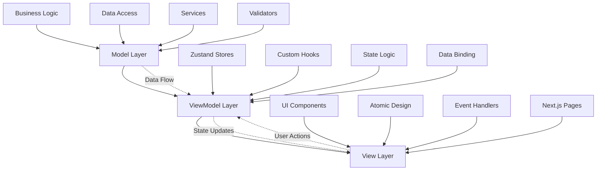
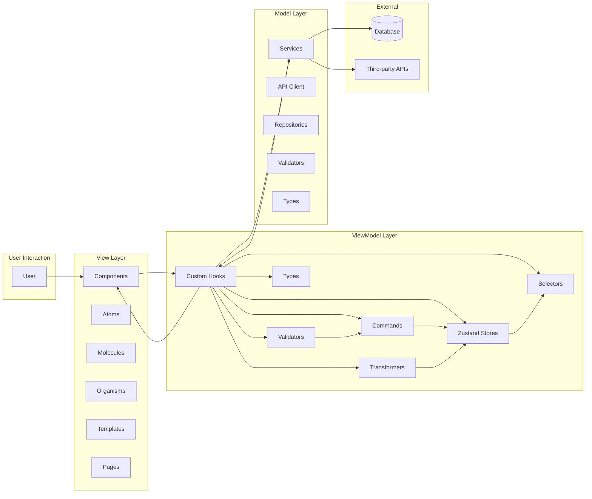

# Architecture Overview

## Overview

This project implements a **Fraud Detection Dashboard** using **MVVM (Model-View-ViewModel)** architecture with **Atomic Design** principles. It integrates with **Apache Pinot** for real-time analytics to analyze credit card transactions and detect fraudulent activity.

## Key Features

### 🔍 Fraud Detection System
- **Real-time Transaction Analysis**: Input credit card transaction details for instant fraud scoring
- **Apache Pinot Integration**: Connects to Pinot instance at `http://93.115.172.151:8099/` for advanced analytics
- **Risk Assessment**: Multi-factor fraud scoring with confidence levels based on real transaction patterns
- **Interactive Dashboard**: Monitor fraud metrics, risk factors, and transaction trends
- **Advanced Visualizations**: Charts and graphs for fraud analytics using Recharts
- **Real-time Features**: WebSocket connections for live transaction feeds and fraud alerts
- **Authentication**: Secure login/register system for internal fraud analysis team

### 🎨 Modern Tech Stack
- **Framework**: Next.js 16 with App Router
- **Language**: TypeScript
- **Styling**: TailwindCSS + ShadcnUI + RadixUI + Custom Theme System
- **State Management**: Zustand
- **Data Visualization**: Recharts for interactive charts and graphs
- **Real-time Communication**: WebSocket client for live updates
- **Design System**: Atomic Design (Atoms, Molecules, Organisms, Templates, Pages)
- **Theme**: Blue & White color scheme with dark mode support

### 📊 Advanced Visualizations
- **Fraud Trends Chart**: Real-time transaction volume and fraud patterns over time
- **Risk Factors Chart**: Pie chart showing distribution of fraud detection triggers
- **Fraud Metrics Overview**: KPI cards with trend indicators and area charts
- **Interactive Dashboards**: Hover tooltips, responsive design, real-time data updates

### 🔄 Real-time Features
- **WebSocket Integration**: Live connection for instant updates
- **Transaction Feed**: Real-time stream of processed transactions with risk levels
- **Fraud Alerts Panel**: Push notifications for high-risk transactions
- **Live Analytics**: Continuously updating fraud metrics and statistics
- **Connection Management**: Auto-reconnection and offline handling

## Architecture Principles

### MVVM Pattern



### Data Flow Architecture



#### Model Layer
- **Location**: `src/models/`
- **Purpose**: Business logic, data access, API services
- **Responsibilities**:
  - Data validation and transformation
  - API communication
  - Business rules and calculations
  - Repository pattern for data access

#### ViewModel Layer
- **Location**: `src/viewmodels/` + `src/hooks/`
- **Purpose**: Bridge between Model and View, manage state and logic
- **Responsibilities**:
  - UI state management with Zustand stores
  - Business logic orchestration through commands
  - Data transformation via transformers
  - Form validation with business rules
  - Computed state through selectors
  - Data binding for components
  - Event handling and user interactions

**Subdirectories:**
- **`stores/`**: Zustand stores for global state management
- **`commands/`**: Complex multi-step operation orchestration
- **`selectors/`**: Computed/derived state from stores
- **`validators/`**: Business logic validation rules
- **`transformers/`**: Data transformation between models and view models
- **`types/`**: ViewModel-specific type definitions

#### View Layer
- **Location**: `src/components/` + `app/` (pages)
- **Purpose**: User interface components
- **Responsibilities**:
  - Render UI based on ViewModel state
  - Handle user interactions
  - Follow Atomic Design structure

## Project Structure

```mermaid
graph TD
    subgraph "Next.js App Router"
        APP[app/]
        APP1[layout.tsx<br/>Root layout]
        APP2[page.tsx<br/>Home page]
        APP3["(auth)/<br/>Route groups"]
        APP4[dashboard/<br/>Protected routes]
        APP5[api/<br/>API routes]
    end

    subgraph "Source Code (src/)"
        SRC[src/]
    end

    subgraph "View Layer"
        COMP[components/]
        COMP1[atoms/<br/>Basic UI elements]
        COMP2[molecules/<br/>Component groups]
        COMP3[organisms/<br/>Complex UI sections]
        COMP4[templates/<br/>Page layouts]
    end

    subgraph "ViewModel Layer"
        VM[viewmodels/]
        VM1[stores/<br/>Zustand stores]
        VM2[commands/<br/>Operation orchestration]
        VM3[selectors/<br/>Computed state]
        VM4[validators/<br/>Business validation]
        VM5[transformers/<br/>Data transformation]
        VM6[types/<br/>ViewModel types]
        HOOKS[hooks/<br/>Custom React hooks]
    end

    subgraph "Model Layer"
        MODEL[models/]
        MODEL1[types/<br/>TypeScript definitions]
        MODEL2[services/<br/>API services]
        MODEL3[repositories/<br/>Data access]
        MODEL4[validators/<br/>Data validation]
    end

    subgraph "Infrastructure"
        LAYOUTS[layouts/<br/>Layout components]
        CONTEXTS[contexts/<br/>React Context providers]
        UTILS[utils/<br/>Utility functions]
        LIB[lib/<br/>Third-party integrations]
    end

    APP --> APP1
    APP --> APP2
    APP --> APP3
    APP --> APP4
    APP --> APP5

    SRC --> COMP
    SRC --> VM
    SRC --> MODEL
    SRC --> LAYOUTS
    SRC --> CONTEXTS
    SRC --> UTILS
    SRC --> LIB

    COMP --> COMP1
    COMP --> COMP2
    COMP --> COMP3
    COMP --> COMP4

    VM --> VM1
    VM --> VM2
    VM --> VM3
    VM --> VM4
    VM --> VM5
    VM --> VM6
    SRC --> HOOKS

    MODEL --> MODEL1
    MODEL --> MODEL2
    MODEL --> MODEL3
    MODEL --> MODEL4

    classDef app fill:#e8f5e8,stroke:#2e7d32
    classDef view fill:#fff3e0,stroke:#ef6c00
    classDef viewmodel fill:#fce4ec,stroke:#c2185b
    classDef model fill:#e3f2fd,stroke:#1565c0
    classDef infra fill:#f3e5f5,stroke:#6a1b9a

    class APP,APP1,APP2,APP3,APP4,APP5 app
    class COMP,COMP1,COMP2,COMP3,COMP4 view
    class VM,VM1,VM2,VM3,VM4,VM5,VM6,HOOKS viewmodel
    class MODEL,MODEL1,MODEL2,MODEL3,MODEL4 model
    class LAYOUTS,CONTEXTS,UTILS,LIB infra
```



### Directory Structure Details

```
src/
├── components/           # View Layer - UI Components (Atomic Design)
│   ├── atoms/           # Basic UI elements (Button, Input, Icon, Typography)
│   ├── molecules/       # Simple component groups (login-form.tsx, transaction-form.tsx, fraud-check-dialog.tsx, realtime-transaction-feed.tsx, fraud-alerts-panel.tsx, theme-switcher.tsx)
│   ├── organisms/       # Complex UI components (audit-log-viewer.tsx, user-management.tsx, fraud-map.tsx, fraud-metrics-overview.tsx, fraud-trends-chart.tsx, risk-factors-chart.tsx)
│   ├── templates/       # Page-level component arrangements (currently unused - see layouts/)
│   └── pages/           # Specific instances of templates with real content
├── layouts/             # Layout Templates (Next.js convention)
│   ├── auth-layout.tsx  # Authentication page layout (centered, branded)
│   └── dashboard-layout.tsx # Main app layout (sidebar + header + content)
├── models/              # Model Layer - Business Logic
│   ├── types/          # TypeScript type definitions
│   ├── services/       # API and external services (pinot-client.ts, websocket-client.ts)
│   ├── repositories/   # Data access layer
│   └── validators/     # Data validation
├── viewmodels/          # ViewModel Layer - State & Logic
│   ├── stores/         # Zustand stores (State management)
│   ├── commands/       # Complex operation orchestration
│   ├── selectors/      # Computed/derived state
│   ├── validators/     # Business validation rules
│   ├── transformers/   # Data transformation logic
│   └── types/          # ViewModel type definitions
├── hooks/              # Custom React hooks (useAuth, useRealtimeData, useWebSocket)
├── contexts/           # React Context providers
│   ├── theme-context.tsx
│   ├── auth-context.tsx
│   └── app-context.tsx
├── layouts/            # Layout components
│   ├── dashboard-layout.tsx
│   └── auth-layout.tsx
├── utils/              # Utility functions
│   ├── constants.ts
│   ├── helpers.ts
│   └── formatters.ts
└── lib/                # Third-party integrations
    ├── zustand.ts
    └── shadcn-ui.ts

app/                    # Next.js App Router
├── layout.tsx          # Root layout with providers
├── page.tsx           # Home page
├── (auth)/            # Route groups
│   ├── login/         # Login page
│   └── register/      # Registration page
├── dashboard/         # Protected routes
└── api/               # API routes
```
