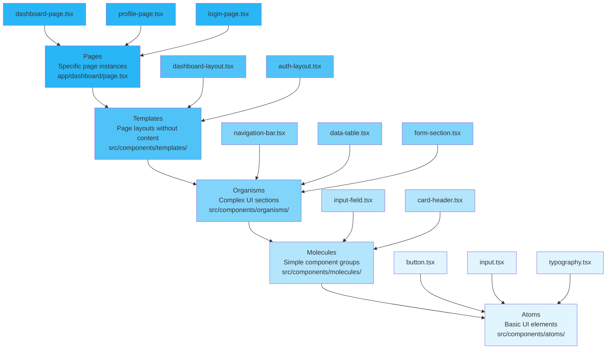
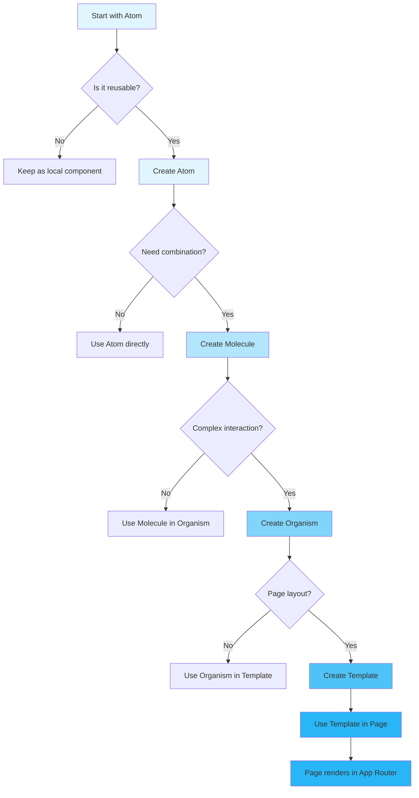

# Atomic Design System

## Overview

This project implements **Atomic Design** as the component design system. Atomic Design is a methodology for creating design systems by breaking down interfaces into fundamental building blocks that can be recombined to create more complex patterns.

## Atomic Design Hierarchy



## Component Levels

### Atoms (`src/components/atoms/`)
**Purpose**: Basic building blocks that cannot be broken down further without losing functionality.

**Examples:**
- Button, Input, Icon, Typography
- Links, Images, Labels

**Characteristics:**
- Reusable across the entire application
- No business logic
- Pure presentation components
- Highly configurable through props

**Implementation:**
```typescript
// Button Atom
interface ButtonProps {
  variant?: 'primary' | 'secondary' | 'outline';
  size?: 'sm' | 'md' | 'lg';
  disabled?: boolean;
  children: React.ReactNode;
  onClick?: () => void;
}

export function Button({ variant = 'primary', size = 'md', ...props }: ButtonProps) {
  return (
    <button
      className={cn(buttonVariants({ variant, size }))}
      {...props}
    />
  );
}
```

### Molecules (`src/components/molecules/`)
**Purpose**: Groups of atoms that form simple UI patterns and have a specific function.

**Examples:**
- InputField (Input + Label + Error)
- LoginForm (multiple inputs + button)
- CardHeader (title + actions)
- TransactionForm
- FraudAlertsPanel
- ThemeSwitcher

**Characteristics:**
- Combine multiple atoms
- Have specific functionality
- Reusable across different contexts
- May contain some simple logic

**Implementation:**
```typescript
// InputField Molecule
interface InputFieldProps {
  label: string;
  error?: string;
  required?: boolean;
  children: React.ReactNode;
}

export function InputField({ label, error, required, children }: InputFieldProps) {
  return (
    <div className="space-y-2">
      <label className="block">
        <Typography variant="span" size="sm" weight="medium">
          {label}
          {required && <span className="text-destructive ml-1">*</span>}
        </Typography>
      </label>
      {children}
      {error && (
        <Typography variant="p" size="sm" color="destructive">
          {error}
        </Typography>
      )}
    </div>
  );
}
```

### Organisms (`src/components/organisms/`)
**Purpose**: Complex UI sections that combine multiple molecules and atoms.

**Examples:**
- UserManagement (table + forms + filters)
- FraudMap (map + legends + tooltips)
- FraudTrendsChart (chart + controls + data)
- AuditLogViewer
- DataTable

**Characteristics:**
- Complex interactions
- May contain business logic
- Often page-specific but reusable
- Manage their own state

**Implementation:**
```typescript
// UserManagement Organism
interface UserManagementProps {
  currentUser: UserType;
  onUserCreate?: (user: Partial<UserType>) => Promise<void>;
  onUserUpdate?: (userId: string, updates: Partial<UserType>) => Promise<void>;
  onUserDelete?: (userId: string) => Promise<void>;
}

export function UserManagement({ currentUser, ...handlers }: UserManagementProps) {
  const [users, setUsers] = useState<UserType[]>([]);
  const [loading, setLoading] = useState(true);

  // Complex state management and business logic
  useEffect(() => {
    loadUsers();
  }, []);

  return (
    <div className="space-y-6">
      {/* Statistics */}
      <div className="grid grid-cols-4 gap-4">
        {/* Stat cards */}
      </div>

      {/* Filters */}
      <div className="flex gap-4">
        {/* Filter controls */}
      </div>

      {/* Data Table */}
      <DataTable
        data={filteredUsers}
        columns={columns}
        onEdit={handleEdit}
        onDelete={handleDelete}
      />
    </div>
  );
}
```

### Templates (`src/components/templates/`)
**Purpose**: Page-level layouts that define the structure without specific content.

**Examples:**
- DashboardLayout (sidebar + header + content area)
- AuthLayout (centered form container)

**Characteristics:**
- Define page structure
- No business data
- Reusable layouts
- Accept children components

**Implementation:**
```typescript
// DashboardLayout Template
interface DashboardLayoutProps {
  children: React.ReactNode;
}

export function DashboardLayout({ children }: DashboardLayoutProps) {
  return (
    <div className="min-h-screen bg-background">
      <Sidebar />
      <div className="flex-1">
        <Header />
        <main className="p-6">
          {children}
        </main>
      </div>
    </div>
  );
}
```

### Pages (`app/` directory)
**Purpose**: Specific instances of templates with real content and data.

**Examples:**
- Dashboard page
- Login page
- Transaction analysis page

**Characteristics:**
- Concrete implementations
- Contain business data
- Route-specific
- Orchestrate multiple organisms

## Component Creation Flow



## Code Organization Rules

### File Naming Conventions
- **Files**: kebab-case (`user-profile.tsx`, `data-table.tsx`, `theme-context.tsx`)
- **Components**: PascalCase in code (`UserProfile`, `DataTable`)
- **Hooks**: camelCase with 'use' prefix (`useUserData`)
- **Services**: PascalCase with 'Service' suffix (`UserService`)
- **Stores**: PascalCase with 'Store' suffix (`UserStore`)
- **Types**: PascalCase (`User`, `ApiResponse`)

### Directory Structure
```
components/
├── atoms/           # Basic elements
│   ├── index.ts    # Barrel exports
│   ├── button.tsx
│   └── input.tsx
├── molecules/       # Component groups
│   ├── index.ts
│   ├── login-form.tsx
│   └── transaction-form.tsx
├── organisms/       # Complex components
│   ├── index.ts
│   ├── user-management.tsx
│   └── fraud-map.tsx
└── index.ts        # Main component exports
```

### Import Patterns
```typescript
// Barrel exports for clean imports
export { Button } from './atoms/button';
export { Input } from './atoms/input';
export { LoginForm } from './molecules/login-form';
export { UserManagement } from './organisms/user-management';
```

## Best Practices

### Component Design
1. **Single Responsibility**: Each component should do one thing well
2. **Props Interface**: Define clear prop interfaces with TypeScript
3. **Default Props**: Provide sensible defaults for optional props
4. **Accessibility**: Include ARIA attributes and keyboard navigation
5. **Error Boundaries**: Implement error boundaries for complex components

### State Management
1. **Local State**: Use React state for component-specific state
2. **Global State**: Use Zustand stores for shared state
3. **Derived State**: Use selectors for computed values
4. **Effects**: Handle side effects in useEffect hooks

### Styling Guidelines
1. **TailwindCSS**: Use utility classes for styling
2. **Design Tokens**: Consistent spacing, colors, and typography
3. **Responsive Design**: Mobile-first approach
4. **Dark Mode**: Support for light and dark themes

### Performance Considerations
1. **Memoization**: Use React.memo for expensive components
2. **Code Splitting**: Lazy load components when possible
3. **Bundle Analysis**: Monitor bundle size and optimize
4. **Virtual Scrolling**: For large lists and tables

## Component Testing Strategy

### Unit Tests
- **Atoms**: Test props, styling, accessibility
- **Molecules**: Test interactions, validation, state changes
- **Organisms**: Test integration, data flow, user workflows

### Integration Tests
- **Templates**: Test layout responsiveness, navigation
- **Pages**: Test complete user flows, data loading

### Visual Regression Tests
- **Components**: Screenshot comparison for UI consistency
- **Responsive Design**: Test across different screen sizes

## Maintenance and Evolution

### Component Lifecycle
1. **Creation**: Follow the atomic design hierarchy
2. **Review**: Code review for consistency and best practices
3. **Documentation**: Update component documentation
4. **Testing**: Add comprehensive tests
5. **Deprecation**: Mark old components as deprecated before removal

### Design System Updates
1. **Design Tokens**: Update colors, spacing, typography centrally
2. **Component Variants**: Add new variants without breaking changes
3. **Migration Guide**: Provide clear migration paths for breaking changes
4. **Versioning**: Semantic versioning for component libraries
