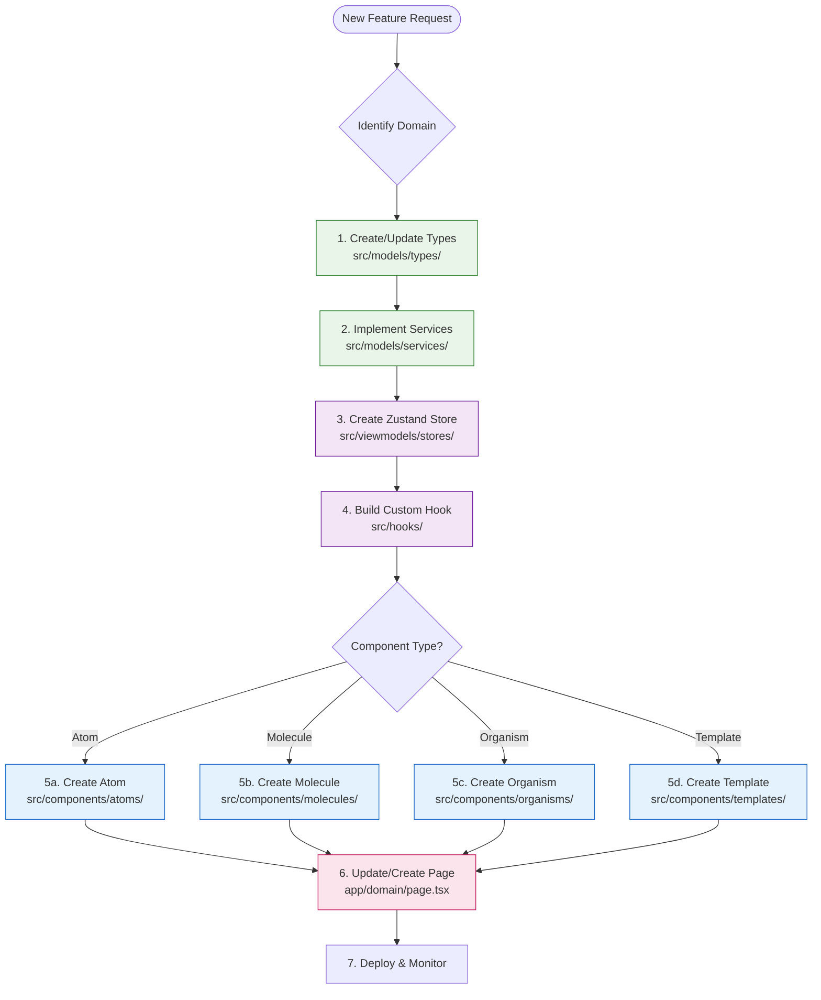

# Development Workflow

## Overview

This document outlines the development workflow for the Realtime Fraud Detection Dashboard. The workflow follows a structured approach that combines MVVM architecture, Atomic Design, and Domain-Driven Design principles.

## Development Lifecycle



## Phase 1: Domain Analysis

### 1. Identify Business Requirements
- **Understand the feature**: What problem does it solve?
- **Define acceptance criteria**: What constitutes success?
- **Identify stakeholders**: Who will use this feature?
- **Analyze dependencies**: What other features/systems are involved?

### 2. Domain Modeling
- **Identify domain entities**: User, Transaction, FraudAnalysis
- **Define value objects**: Money, GeographicLocation, DateRange
- **Establish business rules**: Validation rules and constraints
- **Design domain services**: Complex business operations

### 3. API Contract Design
- **Define API endpoints**: RESTful resource design
- **Establish data contracts**: Request/response schemas
- **Design error handling**: Consistent error responses
- **Plan authentication**: Security requirements

## Phase 2: Implementation

### Step 1: Domain Types (`src/models/types/`)
Create or update domain types first:

```typescript
// 1. Define domain types
export type UserId = string;
export type TransactionId = string;

// 2. Define domain interfaces
export interface UserProps {
  id: UserId;
  username: string;
  email: string;
  // ... other properties
}

// 3. Define domain enums/constants
export type UserRole = 'admin' | 'analyst' | 'viewer' | 'api_user';
export type RiskLevel = 'low' | 'medium' | 'high' | 'critical';
```

### Step 2: Domain Services (`src/models/services/`)
Implement business logic:

```typescript
// 1. Create domain services
export class FraudDetectionService {
  constructor(
    private transactionRepo: TransactionRepository,
    private fraudAnalysisRepo: FraudAnalysisRepository
  ) {}

  async analyzeTransaction(transaction: Transaction): Promise<FraudAnalysis> {
    // Business logic implementation
  }
}

// 2. Implement repository interfaces
export class UserRepositoryImpl implements UserRepository {
  async findById(id: UserId): Promise<User | null> {
    // Data access implementation
  }
}
```

### Step 3: ViewModel Store (`src/viewmodels/stores/`)
Create Zustand store for state management:

```typescript
// 1. Define store interface
interface FraudStore {
  analyses: FraudAnalysis[];
  isLoading: boolean;
  error: string | null;
}

// 2. Implement store
export const useFraudStore = create<FraudStore & FraudActions>((set, get) => ({
  // State
  analyses: [],
  isLoading: false,
  error: null,

  // Actions
  loadAnalyses: async () => {
    set({ isLoading: true });
    try {
      const analyses = await fraudService.getRecentAnalyses();
      set({ analyses, isLoading: false });
    } catch (error) {
      set({ error: error.message, isLoading: false });
    }
  },
}));
```

### Step 4: Custom Hook (`src/hooks/`)
Create reusable ViewModel logic:

```typescript
// 1. Create custom hook
export const useFraudAnalysis = () => {
  const { analyses, isLoading, error, loadAnalyses } = useFraudStore();

  // Business logic
  const highRiskAnalyses = analyses.filter(a => a.isHighRisk());

  // Computed values
  const totalAnalyses = analyses.length;
  const fraudRate = analyses.length > 0
    ? analyses.filter(a => a.isFraudulent()).length / analyses.length
    : 0;

  return {
    analyses,
    highRiskAnalyses,
    totalAnalyses,
    fraudRate,
    isLoading,
    error,
    loadAnalyses,
  };
};
```

### Step 5: UI Components
Follow Atomic Design hierarchy:

#### Atoms (`src/components/atoms/`)
```typescript
// Basic reusable components
export function Button({ variant, size, children, ...props }: ButtonProps) {
  return (
    <button className={cn(buttonVariants({ variant, size }))} {...props}>
      {children}
    </button>
  );
}
```

#### Molecules (`src/components/molecules/`)
```typescript
// Component combinations
export function RiskIndicator({ level, score }: RiskIndicatorProps) {
  return (
    <div className="flex items-center space-x-2">
      <Badge variant={getRiskVariant(level)}>
        {level.toUpperCase()}
      </Badge>
      <Typography variant="span" size="sm">
        Score: {score}
      </Typography>
    </div>
  );
}
```

#### Organisms (`src/components/organisms/`)
```typescript
// Complex components
export function FraudAnalysisTable({ analyses }: FraudAnalysisTableProps) {
  return (
    <div className="space-y-4">
      <div className="flex justify-between items-center">
        <Typography variant="h3">Fraud Analyses</Typography>
        <Button onClick={onRefresh}>Refresh</Button>
      </div>

      <DataTable
        data={analyses}
        columns={columns}
        onRowClick={onAnalysisClick}
      />
    </div>
  );
}
```

### Step 6: Page Implementation (`app/`)
Create the actual page:

```typescript
// Page component
export default function FraudDashboard() {
  const { analyses, isLoading, loadAnalyses } = useFraudAnalysis();

  useEffect(() => {
    loadAnalyses();
  }, [loadAnalyses]);

  return (
    <DashboardLayout>
      <div className="space-y-6">
        <Typography variant="h1">Fraud Analysis Dashboard</Typography>

        {isLoading ? (
          <LoadingSpinner />
        ) : (
          <FraudAnalysisTable analyses={analyses} />
        )}
      </div>
    </DashboardLayout>
  );
}
```

## Phase 3: Testing

### Unit Tests
```typescript
// Domain entity tests
describe('User', () => {
  it('should create valid user', () => {
    const user = User.create({
      username: 'testuser',
      email: 'test@example.com',
      passwordHash: 'hashedpassword',
      role: 'analyst'
    });

    expect(user.username).toBe('testuser');
    expect(user.isActive()).toBe(true);
  });

  it('should validate email format', () => {
    expect(() => User.create({
      username: 'test',
      email: 'invalid-email',
      passwordHash: 'hash',
      role: 'user'
    })).toThrow('Invalid email format');
  });
});

// Component tests
describe('Button', () => {
  it('should render with correct variant', () => {
    render(<Button variant="primary">Click me</Button>);
    expect(screen.getByRole('button')).toHaveClass('bg-primary');
  });
});
```

### Integration Tests
```typescript
// API integration tests
describe('FraudDetectionService', () => {
  it('should analyze transaction and create fraud analysis', async () => {
    const transaction = Transaction.create({
      amount: Money.create(1000, 'USD'),
      merchant: 'Test Merchant',
      type: 'credit_card',
      // ... other properties
    });

    const result = await fraudService.analyzeTransaction(transaction, 'system');

    expect(result.score).toBeGreaterThanOrEqual(0);
    expect(result.score).toBeLessThanOrEqual(100);
    expect(['low', 'medium', 'high', 'critical']).toContain(result.riskLevel);
  });
});
```

### E2E Tests
```typescript
// Playwright E2E tests
test('complete fraud analysis workflow', async ({ page }) => {
  await page.goto('/login');
  await page.fill('[data-testid="username"]', 'yuiiuy');
  await page.fill('[data-testid="password"]', 'password');
  await page.click('[data-testid="login-button"]');

  await page.waitForURL('/dashboard');
  await expect(page.locator('[data-testid="fraud-dashboard"]')).toBeVisible();

  await page.click('[data-testid="analyze-transaction"]');
  // ... complete workflow
});
```

## Phase 4: Code Quality

### Code Review Checklist
- [ ] **TypeScript**: All types properly defined
- [ ] **MVVM**: Clear separation of concerns
- [ ] **Atomic Design**: Components follow hierarchy
- [ ] **Domain Rules**: Business logic in domain layer
- [ ] **Error Handling**: Proper error boundaries
- [ ] **Accessibility**: WCAG compliance
- [ ] **Performance**: No unnecessary re-renders
- [ ] **Security**: Input validation and sanitization

### Linting and Formatting
```bash
# Run linting
npm run lint

# Fix auto-fixable issues
npm run lint:fix

# Type checking
npx tsc --noEmit

# Format code
npx prettier --write .
```

## Phase 5: Deployment

### Build Process
```bash
# Development build
npm run dev

# Production build
npm run build

# Type checking
npm run type-check

# Start production server
npm run start
```

### Environment Setup
```bash
# Copy environment template
cp .env.example .env.local

# Edit with production values
# NEXT_PUBLIC_API_URL=https://api.example.com
# NEXT_PUBLIC_PINOT_URL=https://pinot.example.com
```

### Deployment Checklist
- [ ] **Build successful**: `npm run build` passes
- [ ] **Type check**: No TypeScript errors
- [ ] **Tests passing**: All tests green
- [ ] **Linting clean**: No ESLint errors
- [ ] **Environment configured**: Production env vars set
- [ ] **Assets optimized**: Images and fonts optimized
- [ ] **Security headers**: HTTPS and security headers configured

## Branching Strategy

### Git Flow
```
main (production)
├── develop (integration)
│   ├── feature/user-authentication
│   ├── feature/fraud-analysis
│   └── feature/dashboard-improvements
└── hotfix/security-patch
```

### Commit Convention
```bash
# Feature commits
feat: add user authentication system
feat: implement fraud detection algorithm

# Fix commits
fix: resolve login validation bug
fix: correct fraud score calculation

# Documentation
docs: update API documentation
docs: add deployment guide

# Refactoring
refactor: extract fraud detection service
refactor: simplify component hierarchy
```

## Monitoring and Maintenance

### Error Monitoring
```typescript
// Error boundary for React components
class ErrorBoundary extends Component {
  componentDidCatch(error: Error, errorInfo: ErrorInfo) {
    // Log to monitoring service
    errorReportingService.captureException(error, { errorInfo });
  }
}
```

### Performance Monitoring
```typescript
// Web vitals tracking
import { getCLS, getFID, getFCP, getLCP, getTTFB } from 'web-vitals';

getCLS(console.log);
getFID(console.log);
getFCP(console.log);
getLCP(console.log);
getTTFB(console.log);
```

## Continuous Integration

### CI Pipeline
```yaml
# .github/workflows/ci.yml
name: CI
on: [push, pull_request]

jobs:
  test:
    runs-on: ubuntu-latest
    steps:
      - uses: actions/checkout@v3
      - uses: actions/setup-node@v3
        with:
          node-version: '18'
      - run: npm ci
      - run: npm run lint
      - run: npm run type-check
      - run: npm run build
      - run: npm run test
```

### Quality Gates
- **Code Coverage**: Minimum 80% coverage
- **Performance Budget**: Bundle size limits
- **Security Scan**: Automated security scanning
- **Accessibility**: WCAG AA compliance

## Troubleshooting

### Common Issues

**Build Failures**
```bash
# Clear Next.js cache
rm -rf .next
npm run build
```

**Type Errors**
```bash
# Check TypeScript errors
npx tsc --noEmit

# Update types
npm install @types/package-name
```

**Styling Issues**
```bash
# Rebuild TailwindCSS
npm run dev
# Or check Tailwind config
npx tailwindcss -i ./src/styles/globals.css -o ./dist/output.css --watch
```

**API Connection Issues**
```bash
# Check API endpoints
curl http://93.115.172.151:9000/users
curl http://93.115.172.151:8099/health

# Verify environment variables
echo $NEXT_PUBLIC_API_URL
```

## Best Practices

### Code Organization
- **One responsibility per file**
- **Clear naming conventions**
- **Consistent import structure**
- **Barrel exports for clean imports**

### Performance
- **Lazy loading for components**
- **Memoization for expensive operations**
- **Bundle splitting**
- **Image optimization**

### Security
- **Input validation**
- **XSS prevention**
- **CSRF protection**
- **Secure headers**

### Accessibility
- **Semantic HTML**
- **ARIA attributes**
- **Keyboard navigation**
- **Screen reader support**

### Testing
- **Unit tests for logic**
- **Integration tests for workflows**
- **E2E tests for critical paths**
- **Visual regression tests**

## Tooling

### Development Tools
- **VS Code**: Primary IDE
- **Extensions**: TypeScript, ESLint, Prettier
- **Terminal**: Integrated terminal with npm scripts

### Debugging
- **React DevTools**: Component inspection
- **Zustand DevTools**: State debugging
- **Network Tab**: API request monitoring
- **Performance Tab**: Performance profiling

### Documentation
- **README.md**: Project overview
- **docs/**: Detailed documentation
- **Code Comments**: Inline documentation
- **TypeScript**: Self-documenting code

This workflow ensures consistent, high-quality development while maintaining the architectural integrity of the MVVM + Atomic Design + DDD system.
