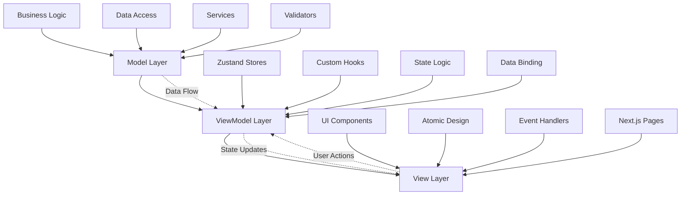
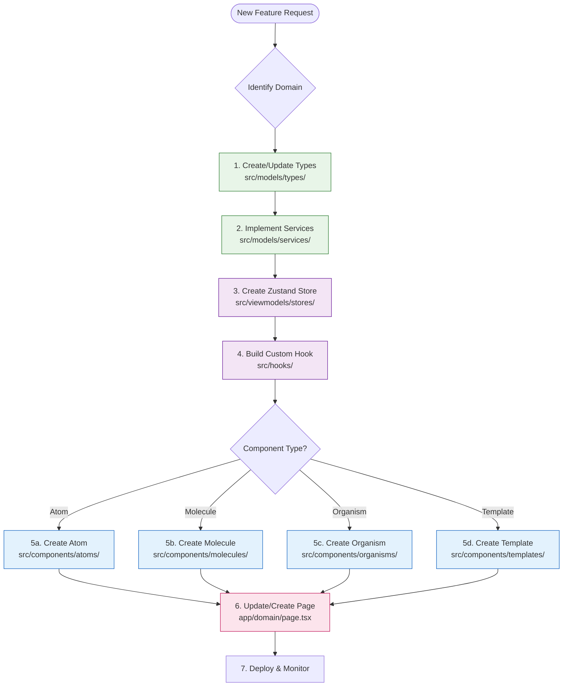
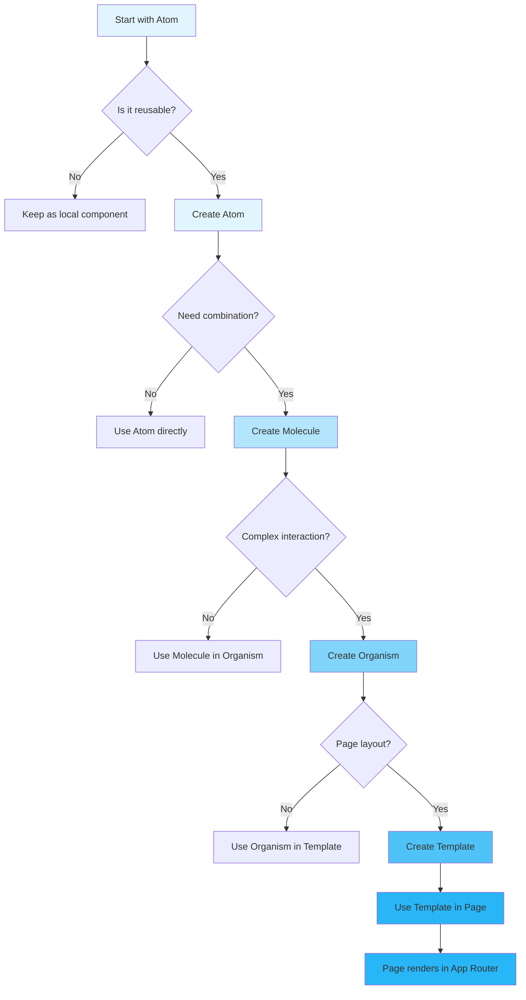

# MVVM Pattern Implementation

## Overview

This project implements the **Model-View-ViewModel (MVVM)** pattern as the core architectural pattern. MVVM provides clean separation of concerns between the user interface (View), the data and business logic (Model), and the intermediary that handles the presentation logic (ViewModel).

## MVVM Architecture



## Layer Responsibilities

### Model Layer (`src/models/`)
The Model layer contains pure business logic and domain knowledge:

**Responsibilities:**
- Domain entities with business rules
- Business logic validation
- Data access interfaces (repositories)
- Domain services for complex operations
- Type definitions for domain concepts

**Key Components:**
- **Entities**: `User`, `Transaction`, `FraudAnalysis` with encapsulated business logic
- **Value Objects**: `Money`, immutable objects representing domain concepts
- **Repositories**: Interfaces for data access (UserRepository, TransactionRepository)
- **Domain Services**: Business operations (FraudDetectionService)
- **Validators**: Business rule validation

### ViewModel Layer (`src/viewmodels/`)
The ViewModel layer acts as an intermediary between the Model and View:

**Responsibilities:**
- UI state management
- Data transformation for presentation
- Command orchestration
- Form validation and error handling
- Event handling and user interactions

**Key Components:**
- **Stores**: Zustand stores for global state management
- **Commands**: Complex multi-step operations (AuthCommands)
- **Selectors**: Computed/derived state from stores
- **Transformers**: Data transformation between Model and View
- **Validators**: ViewModel-level validation (form validation)

### View Layer (`src/components/`)
The View layer handles presentation and user interaction:

**Responsibilities:**
- Rendering UI based on ViewModel state
- Handling user interactions
- Following Atomic Design hierarchy
- Managing UI state and effects

**Key Components:**
- **Atoms**: Basic UI elements (Button, Input, Typography)
- **Molecules**: Component groups (LoginForm, TransactionForm)
- **Organisms**: Complex UI sections (UserManagement, FraudCharts)
- **Templates**: Page layouts (DashboardLayout, AuthLayout)
- **Pages**: Specific page instances

## Data Flow

### Unidirectional Data Flow
```
User Action → View → ViewModel → Model → External API
External API → Model → ViewModel → View → UI Update
```

### State Management
- **Global State**: Zustand stores in ViewModel layer
- **Local State**: React useState for component-specific state
- **Server State**: React Query/SWR for server data (future enhancement)

## Implementation Examples

### Zustand State Management

```mermaid
stateDiagram-v2
    [*] --> Idle

    Idle --> Loading : Action Dispatched
    Loading --> Success : API Success
    Loading --> Error : API Failure
    Error --> Idle : Clear Error
    Success --> Idle : State Updated

    note right of Idle
        Initial State
        user: null
        isLoading: false
        error: null
    end note

    note right of Loading
        API Call in Progress
        isLoading: true
    end note

    note right of Success
        Data Updated
        user: User object
        isLoading: false
        error: null
    end note

    note right of Error
        Error Occurred
        error: "Error message"
        isLoading: false
    end note
```



```typescript
// Example store structure
interface AppState {
  user: User | null;
  isLoading: boolean;
  error: string | null;
}

interface AppActions {
  setUser: (user: User | null) => void;
  setLoading: (loading: boolean) => void;
  setError: (error: string | null) => void;
  login: (credentials: { username: string; password: string }) => Promise<void>;
  logout: () => void;
}

type AppStore = AppState & AppActions;

// Implementation in ViewModel layer
const useAppStore = create<AppStore>((set, get) => ({
  // State
  user: null,
  isLoading: false,
  error: null,

  // Actions
  setUser: (user) => set({ user, error: null }),
  setLoading: (loading) => set({ isLoading: loading }),
  setError: (error) => set({ error, isLoading: false }),

  // Async actions (business logic)
  login: async (credentials) => {
    set({ isLoading: true, error: null });
    try {
      const user = await authService.login(credentials);
      set({ user, isLoading: false });
    } catch (error) {
      set({ error: error.message, isLoading: false });
    }
  },

  logout: () => {
    authService.logout();
    set({ user: null, error: null });
  },
}));
```

### Custom Hooks Pattern

```typescript
// ViewModel hook pattern
export const useUserViewModel = () => {
  const { user, isLoading, error } = useAppStore();
  const userService = useUserService();

  const login = async (credentials: LoginCredentials) => {
    // Business logic here
  };

  const logout = () => {
    // Cleanup logic here
  };

  return {
    user,
    isLoading,
    error,
    login,
    logout,
  };
};
```

## Command Pattern

The Command pattern is used for complex multi-step operations:

```typescript
export class AuthCommands {
  static async login(credentials: LoginCredentials) {
    // Step 1: Validate input
    // Step 2: Set loading state
    // Step 3: Execute login
    // Step 4: Handle success
    // Step 5: Clean up
  }
}
```

## Benefits of MVVM Implementation

### Separation of Concerns
- **Model**: Pure business logic, testable independently
- **ViewModel**: Presentation logic, data transformation
- **View**: UI rendering, user interaction handling

### Testability
- **Unit Tests**: Each layer can be tested in isolation
- **Integration Tests**: Layer interactions can be tested
- **UI Tests**: Component behavior without business logic complexity

### Maintainability
- **Single Responsibility**: Each layer has a clear purpose
- **Dependency Injection**: Clean interfaces between layers
- **Modular Architecture**: Easy to modify or replace components

### Scalability
- **Horizontal Growth**: New features can be added following the pattern
- **Team Collaboration**: Different teams can work on different layers
- **Technology Migration**: Layers can be migrated independently

## Development Workflow



## Component Creation Flow



## Implementation Guidelines

### Component Development
1. **Always use TypeScript** with proper type definitions
2. **Follow Atomic Design** hierarchy
3. **Separate concerns**: UI (View) vs Logic (ViewModel) vs Data (Model)
4. **Use custom hooks** for reusable logic
5. **Implement proper error boundaries**

### State Management
1. **Use Zustand stores** for global state
2. **Keep stores focused** on specific domains
3. **Use selectors** to prevent unnecessary re-renders
4. **Persist state** when needed using Zustand middleware

### API Integration
1. **Centralize API calls** in service layer
2. **Use repositories** for data access patterns
3. **Implement proper error handling** and loading states
4. **Add request/response interceptors** for common logic
